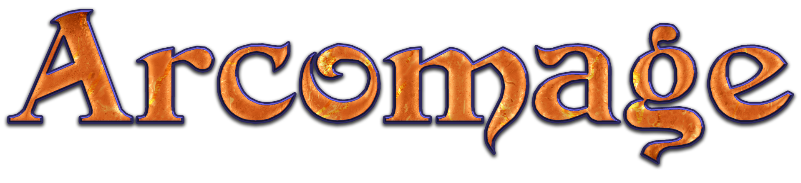
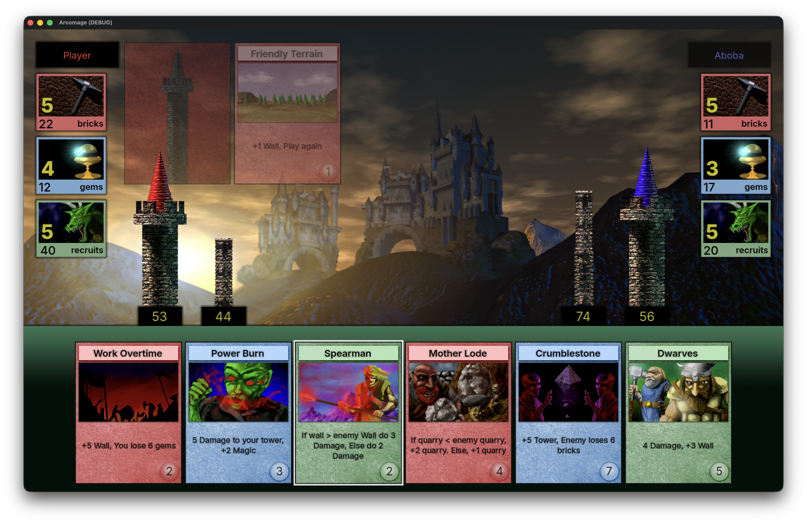

[](https://godotengine.org/)


# Arcomage fan-remake made on Godot Engine

## Description
**Loved by many card mini-game from Might and Magic 7 and 8 returns with updated graphics as standalone game!**



Arcomage is a computer card game for two players. Each player has a random set of six cards, a tower, a wall, three types of resources, and their generators.

**Resources:**
* bricks
* gems
* recruits

**Resource generators (respectively):**
* quarry
* magic
* dungeon

At the beginning of each turn, the generators increase the number of the player's corresponding resources by the current levels of these generators. Each turn a player must use or discard one of his cards. To use the card, a certain amount of one of the resources is required. After using the card, it performs a combination of some actions and instead of it, the player is randomly given another. Further, if the card does not prescribe otherwise, the move goes to the other player.

**Card actions:**
* causing damage to the wall and/or tower (enemy or both the enemy and his own)
* changing the number of resources or the levels of their generators in oneself and/or the enemy
* increasing your own wall and/or tower

**The rules of the game allow victory in any of the following ways:**
* building your tower to the required minimum
* accumulation of any resource to the required minimum
* destruction of the enemy tower

As a rule, cards that require the same type of resources are similar in action. Gems – increase the tower, bricks – walls, animals – to deal damage to the enemy. The damage can be directed specifically at a tower or wall, or be of a general nature. In the second case, the wall takes the damage first, then the tower.

## Localizations
English, Русский, Українська, Polski, Dansk, Deutsch, français  

### Contributors
Thanks to the following people for their help in translating the game:
* **[Zmeonysh](https://www.youtube.com/@Zmeonysh)** (Українська, Polski)
* **[TimawaViking](https://www.reddit.com/user/TimawaViking/)** (Dansk)  

If you want to help with the translation, please [contact me](https://darkpro1337.github.io/). I will be very grateful for your help.

## Also, available at
[](https://darkpro1337.itch.io/arcomage)
[](https://gamejolt.com/games/arcomage/537808)

## System requirements
* Any **x86_64** CPU with **SSE2** support.
* Any GPU with full **Vulkan 1.0** support.
* At least **450 MB** of free RAM.
* At least **265 MB** of free storage.

## Building and editing
### Prerequisites
* [**Godot** v.4.7.1-stable .NET](https://godotengine.org/download/archive/4.7.1-stable/)
* [**.NET** 10 SDK](https://dotnet.microsoft.com/en-us/download/dotnet/10.0)
* Recommended [**Rider**](https://www.jetbrains.com/rider/download) or [**VS Code**](https://code.visualstudio.com/download) external editors with Godot C# extensions ([learn here](https://docs.godotengine.org/en/latest/tutorials/scripting/c_sharp/c_sharp_basics.html#configuring-an-external-editor)).
* Optional, for online multiplayer: [**Docker Desktop**](https://www.docker.com/products/docker-desktop/) (or Docker Engine + Compose)

### How to run the project
1. Clone the repository with `git clone https://github.com/DarkPro1337/arcomage.git` or [download repo ZIP](https://github.com/DarkPro1337/arcomage/archive/refs/heads/mono.zip).
2. Open the project in [**Godot Engine .NET**](https://godotengine.org/download/archive/4.7.1-stable/)
3. Press `F5` to run the project

**Optional:** Export the project to your desired platform (Project → Export...)

## Online multiplayer (Nakama)

LAN still works from **Multiplayer Game** with Create/Join Server and an IP. Global matchmaking, room codes, in-match chat, and ranked play go through a self-hosted [Nakama](https://heroiclabs.com/nakama/) server. itch.io / GameJolt / GitHub are only storefronts — they do not provide the network.

Online matches can be **1v1**, **2v2**, or **free-for-all** (3–4 players). Choose the mode in **Multiplayer Game** before **Find Match**, **Create Room**, or **Join Room**.

### Local development

1. Install Docker Desktop and start it.
2. From the repo:

```bash
cd docker
docker compose up
```

3. Wait until the log shows `Startup done`. The game already defaults to `127.0.0.1:7350` (`defaultkey`).
4. In the game, open **Multiplayer Game**: **Find Match**, **Create Room**, or **Join Room**. Create/Join Server is the old LAN path and does not need Nakama.

Two Godot instances on the same PC share one hardware id, so Nakama would treat them as one player. Give the second instance a different `--playerName` (this only affects the Nakama device account, not real users):

```bash
godot --path "./"
godot --path "./" --playerName=Test
```

Then **Create Room** on the first client and **Join Room** with that code on the second. The console should list two players, not one.

Useful URLs while Compose is running:

* Game API / WebSocket: `http://127.0.0.1:7350`
* Nakama Console: [http://127.0.0.1:7351](http://127.0.0.1:7351) (default login `admin` / `password`)

Stop with `Ctrl+C`, or `docker compose down` in `docker/`. After bumping the Nakama image, reset local data with `docker compose down -v` then `docker compose up -d` (`-v` drops the Postgres volume).

### Production (VDS)

Use the same `docker/docker-compose.yml` on a VDS (about 1 vCPU / 2 GB RAM is enough). Point clients at that host:

* settings in `user://settings.json`: `NakamaHost`, `NakamaPort`, `NakamaUseSsl`, `NakamaServerKey`
* or launch flags: `--nakamaHost=your.server.example --nakamaPort=7350 --nakamaSsl`

Change Nakama’s default keys and console password before exposing the server to the internet. Optional ranked dedicated host:

```bash
godot --headless -- --dedicated --nakamaHost=your.server.example
```

## Support project development
[](https://github.com/sponsors/DarkPro1337)
[](https://tronscan.org/#/address/TT1F6ptBedtbvc12Gjc8YRXFXJxYA1kxBd)
