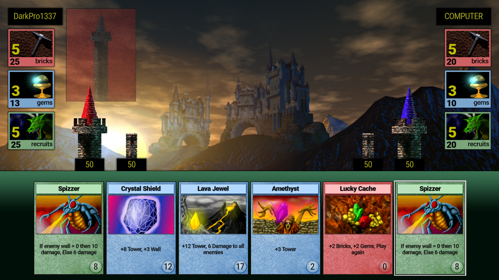

# Arcomage fan-remake made on Godot Engine

## Description
**Loved by many card mini-game from Might and Magic 7 and 8 returns with updated graphics as standalone game!**

Arcomage is a computer card game for two players. Each player has a random set of 6 cards, a tower, a wall, three types of resources and their generators.

**Resources:**
* bricks
* gems
* recruits

**Resource generators (respectively):**
* quarry
* magic
* dungeon

At the beginning of each turn, the generators increase the amount of the player's corresponding resources by the current levels of these generators. Each turn a player must use or discard one of his cards. To use the card, a certain amount of one of the resources is required. After using the card, it performs a combination of some actions and instead of it the player is randomly given another. Further, if the card does not prescribe otherwise, the move goes to the other player.

**Card actions:**
* causing damage to the wall and/or tower (enemy or both the enemy and his own)
* changing the amount of resources or the levels of their generators in oneself and/or the enemy
* increasing your own wall and/or tower

**The rules of the game allow victory in any of the following ways:**
* building your tower to the required minimum
* accumulation of any resource to the required minimum
* destruction of the enemy tower

As a rule, cards that require the same type of resources are similar in action. Gems - increase the tower, bricks - walls, animals - to deal damage to the enemy. The damage can be directed specifically at a tower or wall, or be of a general nature. In the second case, the wall takes the damage first, then the tower.

## Localizations
 English,  Русский,  Українська,  Polski,  Dansk,  Deutsch,  français  

### Contributors
Thanks to the following people for their help in translating the game
* **[Zmeonysh](https://www.youtube.com/@Zmeonysh)** ( Українська,  Polski)
* **[TimawaViking](https://www.reddit.com/user/TimawaViking/)** ( Dansk)  

If you want to help with the translation, please [contact me](https://darkpro1337.github.io/), I will be very grateful for your help.

## Also, available at

## System requirements
* Any **x86_64** CPU with **SSE2** support.
* Any GPU with full **Vulkan 1.0** support.
* At least **450 MB** of free RAM.
* At least **265 MB** of free storage.

## Building and editing
### Prerequisites
* [**Godot** v.4.3 stable mono](https://downloads.tuxfamily.org/godotengine/4.3/mono/)
* [**.NET** SDK](https://dotnet.microsoft.com/download)
* Recommended [**Rider**](https://www.jetbrains.com/rider/download) or [**VS Code**](https://code.visualstudio.com/download) external editors with Godot C# extensions ([learn here](https://docs.godotengine.org/en/4.3/tutorials/scripting/c_sharp/c_sharp_basics.html#configuring-an-external-editor)).

### How to run the project
1. Clone the repository with `git clone https://github.com/DarkPro1337/arcomage.git` or [download repo ZIP](https://github.com/DarkPro1337/arcomage/archive/refs/heads/mono.zip).
2. Open the project in [**Godot Engine .NET**](https://downloads.tuxfamily.org/godotengine/4.3/mono/)
3. Press `F5` to run the project

**Optional:** Export the project to your desired platform (Project -> Export...)

## Support project development

